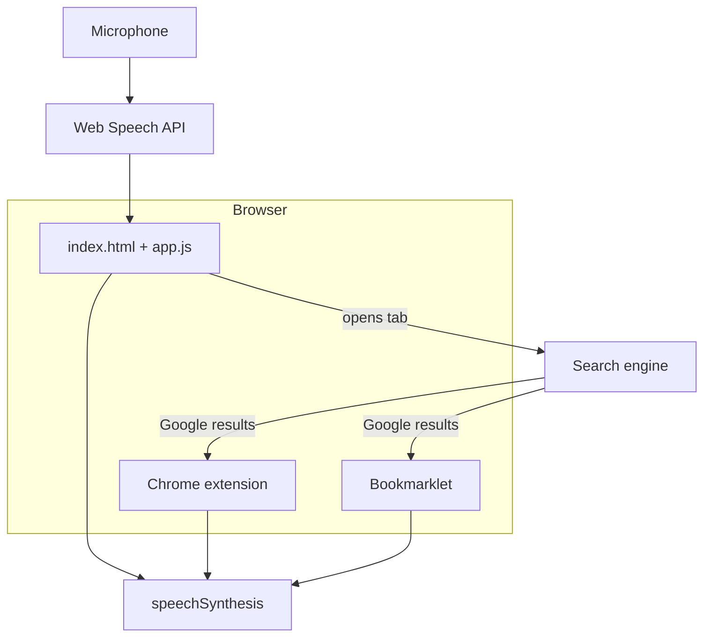

# Architecture

Snoopy is a privacy-first, static voice assistant for web search. There is no
backend server, API key, or persistent browser storage in the core design.

## Components

### Voice browsing agent (`app.js`)

- **Input:** Web Speech API (`SpeechRecognition`), continuous listening after Start.
- **Parsing:** `cleanTranscript()` strips wake phrases (`hey Snoopy`) and command
  prefixes (`search`, `look up`, etc.).
- **Output:** Opens search URL in a reserved window (pop-up friendly) or fallback
  `_blank` with `noopener,noreferrer`.
- **Speech:** Only fixed strings in `speechLines`; raw queries are never spoken.
- **Handoff:** `buildPrivateHandoff()` exports JSON for continuity to another agent.

### Chrome extension (`extension/`)

- **Scope:** `https://www.google.com/*` only.
- **Role:** Reads visible Google AI summary text and speaks a filtered version
  with a Toby-focused intro.
- **Constraints:** No background worker, no `storage` permission, no remote
  assets (enforced by policy script).

### Bookmarklet (`summary-bookmarklet.js`)

- Same summary-reading behavior for managed Chrome profiles that block unpacked
  extensions.
- Setup page: `summary-bookmarklet.html` (same CSP rules as main app).

## Security model

| Layer | Mechanism |
| ----- | --------- |
| App HTML | CSP: `connect-src 'none'`, same-origin scripts/styles |
| Referrers | `no-referrer` meta; external links use `noopener noreferrer` |
| Search windows | `opener` cleared on reserved window; fallback uses `noopener,noreferrer` |
| Code policy | `scripts/check-agent-policy.js` blocks storage, fetch, beacons in browser code |
| Microphone | `Permissions-Policy`: microphone only for same origin; user gesture to start |

Search queries necessarily leave the browser when results load on Google (or
another chosen engine). That is expected; the app itself does not phone home.

## CI and deploy

- **Test:** `npm test` in workflow before deploy.
- **Deploy:** Copies a minimal `dist/` subset to GitHub Pages (see
  [OPERATIONS.md](OPERATIONS.md)).

## Extension points (future)

- Raspberry Pi kiosk or wake-word daemon (see [RASPBERRY-PI.md](RASPBERRY-PI.md))
- Additional intents beyond search (home automation, timers) would need a new
  router while keeping the same speech-safety rules
