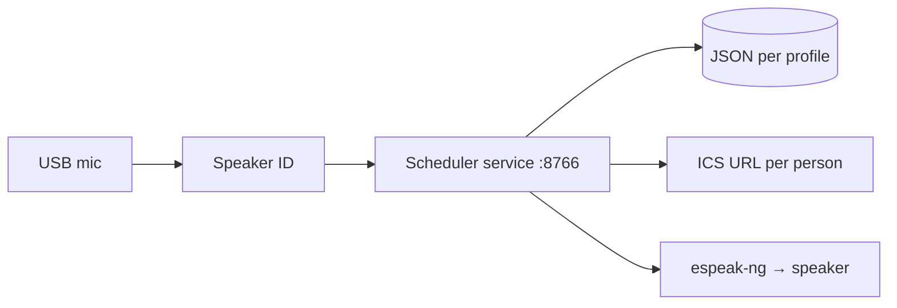

# Reminders, routines, and calendars (Raspberry Pi)

Scheduling is **Pi-only**. It does not run in the browser, does not use
`localStorage`, and does not need Chromium open to speak.

## How it works



1. **Voice enrollment** (`pi/speaker-id/`) creates profiles: `toby`, `mum`, etc.
2. **Scheduling service** (`pi/scheduling/`) stores reminders/routines **per profile**.
3. When you add something by voice, the Pi **identifies the speaker** and writes to
   **that profile only**.
4. At the set time, **espeak-ng** reads the reminder aloud (no browser).

## Per-person calendars

| Person | Profile id | Calendar link |
| ------ | ---------- | ------------- |
| Toby | `toby` | Toby's secret ICS URL in config |
| Mum | `mum` | Mum's secret ICS URL |

Configure separately:

```bash
python cli.py calendar --profile toby --ics-url "https://…"
python cli.py calendar --profile mum --ics-url "https://…"
```

Phone calendars sync to the cloud; the Pi reads each person's subscribe link.
There is no direct hook into the Calendar app — only the link you paste.

## Browser / Chromium

The web page (`index-pi.html`) is **not** used for scheduling. You can still use
Chromium for Google search if you want, but reminders and calendar alerts work
with **scheduler + speaker only**.

## Zane RC car

Scheduling does not use GPIO. It can run on the same Pi as Zane.

## Operations

Full install: [pi/scheduling/README.md](../pi/scheduling/README.md).

| Problem | Fix |
| ------- | --- |
| No speech at reminder time | `sudo apt install espeak-ng`; `systemctl status snoopy-scheduler` |
| Wrong person's schedule | Re-enroll voice; use `cli.py voice` so ID runs before save |
| Calendar empty | Check ICS URL for that `profileId`; `python cli.py show --profile toby` |
