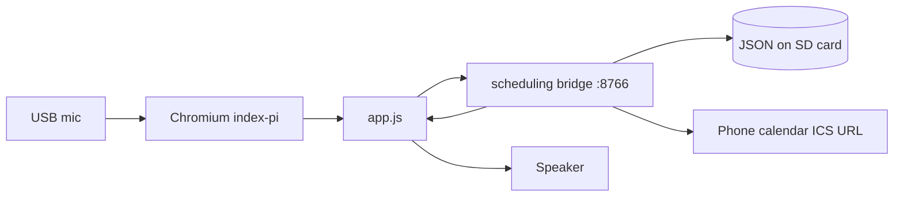

# Reminders, routines, and calendar on the Pi

Snoopy scheduling runs **only on the Raspberry Pi**. Laptops use voice search
without this feature unless you run the scheduler bridge locally for testing.

## Features

| Feature | Storage | Spoken when due |
| ------- | ------- | ---------------- |
| **Reminders** | `~/.config/snoopy/scheduling.json` | Yes |
| **Routines** (repeating times) | Same file | Yes |
| **Calendar** (optional ICS) | Cached locally | Yes |

## Architecture

The browser does **not** store schedules in `localStorage`. The Pi bridge owns
all schedule data.

## Calendar and your phone

There is no direct link to the Calendar app on your phone. You connect the **same
cloud calendar** the phone already syncs with:

- **Google Calendar** — secret iCal link
- **Apple iCloud** — calendar subscription URL (CalDAV/ICS)
- **Outlook** — publish or subscribe link if available

Paste that URL on the Pi once. Edits on your phone appear after the next sync
(default every 15 minutes, or when you ask to list calendar).

## Laptop vs Pi

| | Laptop `index.html` | Pi `index-pi.html?pi=1` |
| --- | --- | --- |
| Reminders | Not available | Yes |
| Routines | Not available | Yes |
| Calendar ICS | Not available | Yes |
| Voice setup | Wake + search | Wake + search + schedule commands |

## Operations

Install and enable the service: [pi/scheduling/README.md](../pi/scheduling/README.md).

Troubleshooting:

| Problem | Fix |
| ------- | --- |
| Schedule panel says bridge offline | `sudo systemctl start snoopy-scheduler` |
| No spoken reminder | Chromium kiosk must be open; check pending: `curl http://127.0.0.1:8766/v1/pending-speech` |
| Calendar empty | Check ICS URL, enable sync, run `curl -X POST http://127.0.0.1:8766/v1/calendar/sync` |
| Wrong time | Set Pi timezone: `sudo raspi-config` → Localisation |

## Zane RC car

Scheduling does not use GPIO. It can run on the same Pi as Zane if the Pi has
enough RAM and Chromium is only open when you want voice + reminders in the room.
