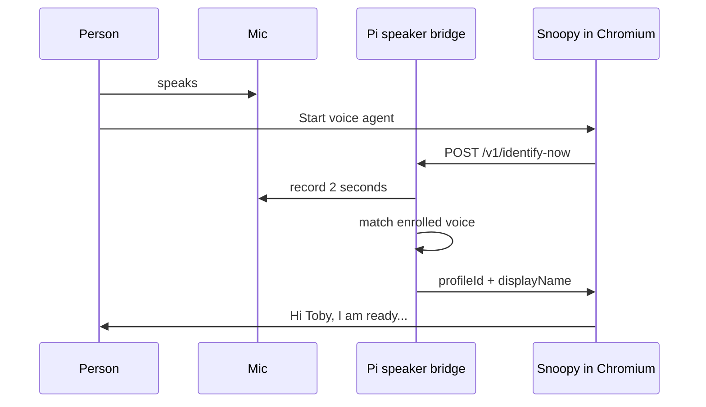

# Speaker profiles (who is speaking)

Snoopy can address **different people by name** when voice recognition runs on the
**Raspberry Pi**. Voice prints stay on the SD card; the browser only receives a
profile id and display name from `http://127.0.0.1:8765` on the Pi.

## How it works



1. **Enrollment** (once per person): record three clips → stored under `pi/speaker-id/profiles/`.
2. **Start listening**: Pi records a short sample and picks the closest profile.
3. **Speech lines**: approved templates use `{name}` → "Toby", "Mum", or "friend" if unknown.
4. **Scheduling** (Pi only): reminders, routines, and calendars are stored **per profileId**
   after voice ID — see [SCHEDULING.md](SCHEDULING.md).

## Laptop vs Pi

| Feature | Laptop browser | Raspberry Pi |
| ------- | -------------- | ------------- |
| Speech-to-text | Web Speech API | Web Speech API |
| Who is speaking | Manual dropdown on page | Automatic voice ID |
| Voice prints stored | No | Yes, local only |
| Page to open | `index.html` | `index-pi.html?pi=1` |

## Enroll someone

On the Pi:

```bash
cd ~/snoopy/pi/speaker-id
source .venv/bin/activate
python enroll.py --id toby --name Toby
python enroll.py --id mum --name Mum
sudo systemctl restart snoopy-speaker-bridge
```

## Run the bridge at boot

```bash
sudo cp ~/snoopy/pi/systemd/snoopy-speaker-bridge.service /etc/systemd/system/
sudo systemctl enable snoopy-speaker-bridge
sudo systemctl start snoopy-speaker-bridge
```

## Open Snoopy on the Pi

Use the Pi kiosk URL:

**http://localhost:8000/index-pi.html?pi=1**

Load the summary extension as described in [pi/speaker-id/README.md](../pi/speaker-id/README.md) and the main Pi guide when available.

## Add a name to the catalog before enrollment

Edit [speakers.js](../speakers.js) on the Pi, or rely on enrollment — enrolled profiles
are merged into the catalog served by the bridge.

## Accuracy tips

- Enroll in a quiet room with the same mic you will use daily.
- Re-enroll if Snoopy confuses two voices (similar pitch/age).
- Unknown voices get the polite label **friend** (guest profile).

## Privacy

- No cloud speaker API.
- No `localStorage` for voice data.
- Bridge listens only on `127.0.0.1` (not reachable from other devices on the LAN).
