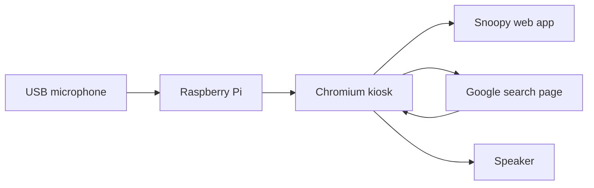

# Snoopy on Raspberry Pi (no laptop in the room)

Your **laptop can stay off**. The Pi stays on a shelf, listens through a USB mic,
speaks through a speaker, and runs Snoopy in Chromium. The same Chrome extension
reads Google AI summaries aloud for Toby.



## What you need

| Item | Notes |
| ---- | ----- |
| Raspberry Pi 4 or 5 (2 GB+ RAM) | Pi 3 works but feels slower |
| MicroSD card (32 GB+) | Raspberry Pi OS (64-bit) |
| USB microphone | Or a USB webcam with mic |
| Powered speaker | 3.5 mm, USB, or Bluetooth |
| Power supply | Official Pi supply recommended |
| Optional: small HDMI display | Only for first-time setup; kiosk can run without a monitor later |
| Wi‑Fi | Pi must reach the internet for Google |

## How it works (plain language)

1. The Pi boots and starts a tiny local web server (`npm run serve`).
2. Chromium opens full screen to `http://localhost:8000` (Snoopy).
3. You load the **Snoopy extension** once in that Chromium profile.
4. Toby says a wake phrase → Snoopy opens Google → extension reads the AI summary aloud.
5. Your laptop is not involved after setup.

---

## Phase 1 — Install Raspberry Pi OS

1. On another computer, use [Raspberry Pi Imager](https://www.raspberrypi.com/software/).
2. Choose **Raspberry Pi OS (64-bit)** for your model.
3. Click the gear icon and set:
   - Hostname: `snoopy-pi`
   - Enable SSH (optional, helpful)
   - Username / password
   - Wi‑Fi (SSID and password)
4. Flash the SD card, insert it in the Pi, connect mic and speaker, power on.

---

## Phase 2 — Copy Snoopy onto the Pi

SSH in (or use the desktop terminal):

```bash
sudo apt update
sudo apt install -y git nodejs npm chromium-browser alsa-utils
```

Clone the repo (use `main` or the branch with wake phrases merged):

```bash
cd ~
git clone https://github.com/tobygbj-hash/snoopy.git
cd snoopy
npm test
```

---

## Phase 3 — Local web server at boot

Install the systemd service so Snoopy is always served on port 8000:

```bash
sudo cp ~/snoopy/pi/systemd/snoopy-web.service /etc/systemd/system/
sudo systemctl daemon-reload
sudo systemctl enable snoopy-web
sudo systemctl start snoopy-web
```

Check:

```bash
curl -s -o /dev/null -w "%{http_code}\n" http://localhost:8000
```

You should see `200`.

---

## Phase 4 — Install the summary reader extension (on the Pi)

On the Pi desktop (or over VNC):

1. Open **Chromium**.
2. Go to `chrome://extensions`.
3. Turn on **Developer mode**.
4. Click **Load unpacked** → select `/home/pi/snoopy/extension` (adjust if your user is not `pi`).
5. Pin the extension if you like.

This is the same extension as on a laptop: it reads the **Google AI summary** in the
current tab and speaks it for Toby.

---

## Phase 5 — Kiosk mode at login (Snoopy full screen)

Edit paths if your username or clone location differs, then:

```bash
mkdir -p ~/.config/autostart
cp ~/snoopy/pi/autostart/snoopy-kiosk.desktop ~/.config/autostart/
```

Log out and back in (or reboot). Chromium should open kiosk-style to Snoopy.

**Manual test first** (before relying on autostart):

```bash
chromium-browser \
  --load-extension=$HOME/snoopy/extension \
  --unsafely-treat-insecure-origin-as-secure=http://localhost:8000 \
  http://localhost:8000
```

Allow the microphone when Snoopy asks.

---

## Phase 6 — Use it like a home speaker

1. Click **Start voice agent** once (or wire a GPIO button later).
2. Say a wake phrase, then your search (see the main README).
3. When Google results open on the Pi, tap **Read AI summary** or use the extension popup.

**Tip:** Log into Google once in that Chromium profile if AI Overviews do not appear.

---

## Optional: monitor not in the room

After setup works, you can run **headless** with no HDMI monitor attached. The Pi
still needs Chromium rendering Google in the background (the extension reads the
page). For a future **no-Chromium** version, see Phase 7 below.

---

## Phase 7 — Later upgrades (not required to start)

| Upgrade | What it adds |
| ------- | ------------- |
| Wake word on device | [openWakeWord](https://github.com/dscripka/openWakeWord) listens for "hey Snoopy" without clicking Start |
| Auto-read summary | Small script clicks "Read AI summary" after results load |
| Headless reader | Node + Playwright reuses extension logic without a visible window |
| Better voice | Piper TTS on the Pi instead of browser `speechSynthesis` |

---

## Troubleshooting

| Problem | Try |
| ------- | --- |
| No microphone | `arecord -l` lists devices; check Chromium site permissions |
| No sound | `speaker-test -t wav -c 2`; raise volume with `alsamixer` |
| Pop-ups blocked | Allow pop-ups for `http://localhost:8000` |
| No AI summary on Google | Log into Google; try a query that shows "AI Overview" |
| Extension missing after reboot | Confirm `--load-extension=` path in `snoopy-kiosk.desktop` |
| Page will not load | `systemctl status snoopy-web` |

---

## Privacy reminder

- The Pi talks to **Google** when it searches (same as the browser app today).
- Snoopy app code still does not use analytics, `fetch`, or browser storage.
- Keep the Pi on your home Wi‑Fi; change default passwords if SSH is enabled.

---

## Quick command reference

```bash
# Restart Snoopy web server
sudo systemctl restart snoopy-web

# View server logs
journalctl -u snoopy-web -f

# Update Snoopy
cd ~/snoopy && git pull && npm test && sudo systemctl restart snoopy-web
```
